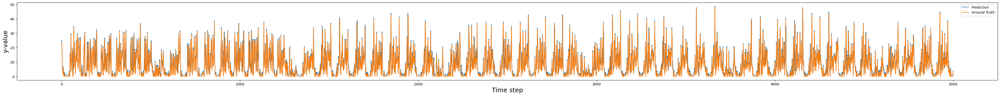

## The Challenge

This challenge was presented to my teammate and I by the Digital Information Platform (DIP) Sub-Project of Air Traffic Management - eXploration (ATM-X). They were seeking to make available in the National Airspace System a variety of live data feeds and services built on that data to save fuel and avoid delays. Different wind directions, weather conditions at or near the airport, inoperative runway, etc., affect the runway configurations to be used and impact the overall arrival throughput. This competition sought to make better predictions of runway throughputs using machine learning or other techniques. The total prize pool for this competition was $120,000 (awarded to the top 8 participants). **In the end, my teammate and I placed 24th out of 400 participants.** Full code at [our GitHub](https://github.com/SamuelTWu/nasaATPchallenge). 

### The Plan

Our project had two main goals. First, we sought to process the raw data into usable and correctly formatted inputs through extensive preprocessing and quantization of human-readable data. Second, we aimed to build a multimodal, multi-step LSTM for time series forecasting. We built this model, along with an XGBoost Regressor, to compare the benefits of both models in time series forecasting.

### The Data
>Data Preprocess

Although straightforward, one of the largest hurdles was preprocessing the available data. To create a plan, we worked backwards. The competition submission required predictions to be sorted by ID that contained an airport, date, and time, organized 15 minute intervals. Because of this, we also split the input data into these buckets. For aggregate features, such as the number of arrivals, we added the total number of flights landing within a certain interval. For other features, such as temperature, cloud cover, and wind speed, we took the average over the interval. We also included one-hot encodings of certain features such as season, lightning probability, and cloud type. 

To best capture the patterns of flight, we also included a myriad of time related features. This included day of year, month, season, and time of day. For cyclical features such as day of year or time of day, we fed the data through a sine function, in order to capture the repeating nature of the data. For example, 11:59 pm and 00:01 am are numerically distant, but fall near each other in time, while numbers like 00:00 am and 12:00 pm are very distant in time. Running the data through a sine function, the former values would fall closer together, while the latter become most distant. 

There are 4 types of data provided by the competition: FUSER, METAR, CWAM, and TAF. The FUSAR data contained runway arrivals, along with low level weather predictions. METAR contained high level, precise weather predictions. TAF contained weather forecasts specifically for aviation. Finally, CWAM contained weather information in the form of a list of polygons at a specific altitude within which there is a percentage of chance greater than 60, 70, 80 percent to be impacted by convective weather. For our purposes, we focused on FUSAR, METAR, and TAF data. 

>METAR

For the METAR dataset, we utilized the metar python package to decode each line of the METAR dataset. We found that many of the lines were either duplicates or very similar to one another, and so we filtered out duplicate data and utilized the ones that were either most recent or captured a unique occurrence within a recent time frame. In this case, a unique occurrence refers to any event that could cause an airport to deliver a METAR shortly after an autogenerated one; examples include rainfall, fog or snow. 

METAR is inherently meant to be a human-readable source of information, despite certain METARs being generated automatically, and so an obstacle we encountered often was that certain METARs would often be left unparsed by the package due to national or personal difference in how they were written. Due to duplicate data and a propensity for certain features to be missing or remain unparsed, we additionally attached a secondary feature for each primary feature that indicated whether the primary was missing, using a numerical value of -1 within the primary itself so that the model could learn the difference between present and missing features.

METAR additionally contains several sources of qualitative data such as cloud cover and weather observations. Cloud cover data is typically expressed in words as FEW (few), SCT (scattered), BKN (broken) or OVC (overcast). Weather data is expressed in two letter representations of common whether phenomena with an added adjustment for heavy or light. Our model cannot meaningfully parse natural language in the form that the metar parser returns, and as a result we quantize these qualitative metrics. 

Cloud cover can be quantized into oktas, how many eighths of the sky are covered by clouds, with FEW, SCT, BKN and OVC mapping to 1-2, 3-4, 5-6 and 7-8 oktas respectively. For our purposes we simply take the averages of 1.5, 3.5, 5.5 and 7.5. Cloud cover is described fractionally and so is a prime target for normalization but the LSTM will require normalized data regardless, so we do not normalize at this stage.

Weather poses a greater difficulty due to the large number of sparse weather phenomena which have a small possibility of occurring. In preprocessing our data, we pick five of the most common and impactful weather conditions in rain, thunderstorms, fog, snow, hail and mist to include in the final dataset. Weather conditions can also be either light or heavy depending on severity, and so we use 0 to indicate a lack of weather, and 1,2 and 3 for light, moderate and heavy weather phenomenon, respectively.

>TAF

We initially created a similar TAF parser with quantization and preprocessing to the previously shown METAR parser using the pytaf library but felt that it would not have benefited our model without a significant change to our data processing. Much of the TAF data overlapped with the METAR and the unique features which did not were difficult to integrate due to the TAF forecasting future weather rather than providing real-time data to pilots as the METAR does. This mismatch means that it would be imprudent to simply add the TAF data directly into our dataset at the current times. We felt that integrating the TAF by 'pulling' the data towards the predictions would be detrimental without a more sophisticated method that we did not have time to implement. 

>PCA

Prior to training, we performed some PCA in order to determine which features were most useful. One useful feature was the estimated number of arrivals. This feature was calculated using the estimated arrival times of flights, where the arrival time was counted towards its respective interval. This feature, along with others such as temperature and time of day, showed strong correlations to the number of arrivals. 

A sample of the processed data is shown below.  

Figure 2: X corresponds to time, with y corresponding to the value of each feature shown in the
legend.

### The Models
###### Finally the good stuff
>Multistep/multimodel LSTM

In order to input data into the LSTM, we must first normalize the data. To do this, we use a MinMaxScaler to fit and transform the features. We then save this scaler for the inverse transformation of the predictions. The model takes the features as rows according to the time step index and trains an RNN on the features for each timestep. This allows the RNN to make predictions multiple steps into the future, though for our purposes we only predict one time step into the future. Thus, to make predictions, the model is given n steps in and predicts 1 step out. We found that the model’s predictions became more accurate the larger n was, thus we increased the n to around 100, or 1 day worth of inputs. We also introduced a custom layer that artificially increased the initial weight for specific features. This was done to encourage the RNN to ‘pay attention’ to certain features. In our case, we increased the initial weight of the ‘estimated number of arrivals’ feature as it showed the strongest correlation to the number of arrivals. We experimented with different components of the RNN to see which hyperparameters produced the best predictions during testing. We experimented with LSTM layers from 2-4, timesteps in from 100-720, LSTM layer size from 64 to 128, initial weight size from 1 to 64, and batch size from 256 to 1024. Our best performing model had an initial weight of 64, 3 LSTM layers of size 64, in steps of 420, and batch size of 1024, with a *RMSE of 5.299 and a competition score (exp(-RMSE/10)) of 0.589.*

>XGBoost Regressor

We also experimented with an XGBoost Regressor. We chose this model because of its quick training times and capacity to handle large amounts of data. The input features remained the same as the LSTM. We experimented with differing hyperparameters in order to maximize the RMSE. We tested n estimators from 200 to 20000 and max depth from 8 to 16, with the highest scoring model receiving a *RMSE of 3.685 and a competition score (exp(-RMSE/10)) of .69.* We also evaluated the importance of each feature used in the XGBoost model by examining its feature importance scores. This analysis revealed that certain features, such as temperature and wind speed, had a disproportionately higher influence on the model’s predictions compared to others. Leveraging this insight, we considered simplifying the model by removing less impact- ful features to reduce overfitting and enhance interpretability, but this adjustment did not yield significant improvements in performance.

>Data Postprocess

For both processes, data post-processing was required. For the LSTM in particular, predictions were run through a multi-threaded program to improve prediction speeds. These predictions were then re-indexed according to the submission format buckets and saved as a .csv. We experimented with rounded and unrounded outputs in our submissions and found no significant difference in score. The best submissions can be found on the GitHub.

### The Results
The performance of the proposed models was evaluated using RMSE and the competition exclusive metric of (exp(-RMSE/10)). Both models demonstrated high precision and robustness during testing, effectively distinguishing important features and arrival time patterns. Below are the key results:

>XGBoost Regressor
$$
\textbf{RMSE: } 3.685 (\#  of  arrivals)
\\
\textbf{exp(-RMSE/10): } .69
$$
>Mutlistep Multimodal LSTM
$$
\textbf{RMSE: } 5.299 (\# of arrivals)
\\
\textbf{exp(-RMSE/10):} 0.589
$$

These metrics indicate that the models were able to capture large patterns in the dataset in order to predict the number of arrivals. However, it failed to capture smaller details that may have decreased the RMSE, thus increasing the final score. Further approaches may include removing features that introduce too much noise and possibly introducing more features that may help capture small patterns still unnoticed by the model. This feature extraction may be limited due to the sheer volume of the competition dataset, which was one of the largest obstacles in working on this competition. 

>Performance Visualization

Model performance on a sample dataset. The closeness of the blue (ground truth) and orange (predicted) lines shows the accuracy of the model.

The figure above shows the trends of key performance metrics over the training epochs. The
stability of these metrics while managing to capture the pattern of the data indicates that the
model generalizes well without overfitting.

### Conclusion

This paper details our methodology and results to predict airport arrival for the NASA challenge. Overall, we observe that our feature engineering and preprocessing especially with regard to the time intervals and PCA, respectively, aided our model significantly. We did not notice a substantial improvement from using all the data and noticed that a substantial amount of it contained overlapping information, especially the METAR and the TAF datasets. Our RMSE of 3.685 and ranking 20th on the leaderboard show that our model achieved significant precision in predicting arrivals. Future work could focus on ensembling methods and attention based mechanisms to give greater weight to features with a larger impact on the arrivals. 

### GitHub

See our full code at [our GitHub](https://github.com/SamuelTWu/nasaATPchallenge). 